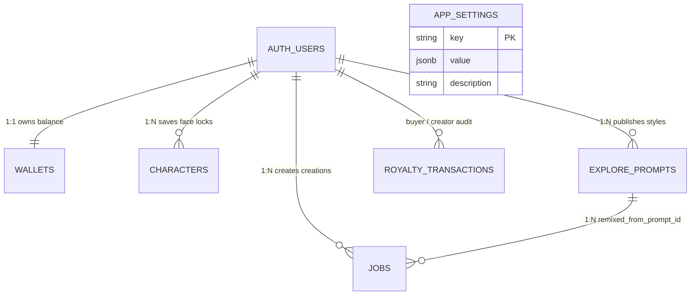

# 🗺️ CraftAI Studio — Master Architecture, File Structure & Function Directory
**Target Audience:** Mobile Developers (Flutter), Backend Engineers (Python/FastAPI), and Full-Stack Contributors  
**Purpose:** Never go blank again. Instantly understand the entire codebase, know which file and function does what, and navigate any flow in under 30 seconds.

---

## 1. The 30-Second Mental Model

CraftAI Studio is built on clean, decoupled layers so that **UI never talks to databases or external AI directly**:

```
📱 MOBILE (Flutter + GetX)                          🖥️ BACKEND (FastAPI + Python)
┌──────────────────────────────────────┐            ┌──────────────────────────────────────┐
│  Presentation View (UI Widgets)      │            │  API Endpoints (FastAPI Routers)     │
│  "Draws the screen, listens to state"│            │  "Validates auth token & payload"    │
└──────────────────┬───────────────────┘            └──────────────────┬───────────────────┘
                   │ User Action (tap)                                 │
┌──────────────────▼───────────────────┐            ┌──────────────────▼───────────────────┐
│  GetX Controller (State & Business)  │            │  Domain Services (Business Logic)    │
│  "Holds observables, credits, logic" │            │  "Orchestrates privacy, credits, job"│
└──────────────────┬───────────────────┘            └──────────────────┬───────────────────┘
                   │ Dispatches                                        │
┌──────────────────▼───────────────────┐            ┌──────────────────▼───────────────────┐
│  Repository & Remote Datasource      │ ──HTTP/WS─►│  Infrastructure Clients (AI / DB)    │
│  "Dio client, headers, base URL"     │            │  "Pollinations, Groq, Gemini, Supa"  │
└──────────────────────────────────────┘            └──────────────────────────────────────┘
```

* **Frontend Rule:** Views **only observe** controllers. Controllers **only call** repositories. Repositories **only call** datasources.
* **Backend Rule:** Endpoints **only validate** requests. Endpoints delegate to **Services**. Services call **Clients** (Groq, Gemini, Pollinations) or **Supabase DB**.
* **Zero-Retention Privacy Rule:** User selfie photos are kept in Supabase storage for **only 25 seconds** (just enough to render), then automatically purged in the background.

---

## 2. Complete Visual Directory Structure

### 📱 Frontend: `craftai_studio_mobile/`
```text
craftai_studio_mobile/
├── CODE_MAP.md                                # 📍 You are here (Single source of truth developer manual)
├── pubspec.yaml                               # Flutter dependencies (GetX, Dio, Supabase, CachedNetworkImage)
└── lib/
    ├── main.dart                              # App entry point: initializes Supabase, runs CraftAiApp
    ├── core/                                  # Global configurations, theme, routing, utilities
    │   ├── constants/
    │   │   ├── app_colors.dart                # Brand colors (Obsidian dark palette, neon cyan/amber accents)
    │   │   ├── app_dimens.dart                # Standard spacing, paddings, border radii (No magic numbers!)
    │   │   ├── app_strings.dart               # User-facing localized strings
    │   │   └── app_text_styles.dart           # Typography (Inter/Google fonts, headings, subtitles)
    │   ├── network/
    │   │   ├── api_config.dart                # Centralized backend URL & environment resolver (Zero hardcoded URLs)
    │   │   └── dio_logging_interceptor.dart   # Pretty-printed network request & response terminal logs
    │   ├── routes/
    │   │   ├── app_pages.dart                 # GetPage definitions & bindings
    │   │   └── app_routes.dart                # Route name constants ('/splash', '/shell', etc.)
    │   ├── services/
    │   │   └── supabase_service.dart          # Supabase client singleton initialization
    │   ├── theme/
    │   │   └── app_theme.dart                 # Dark theme ThemeData definitions
    │   └── utils/
    │       └── app_logger.dart                # Enterprise colorized terminal logger (AppLogger.i/s/e)
    ├── data/
    │   └── models/                            # Shared data transfer models (DTOs)
    │       ├── character_model.dart           # Character consistency descriptor model
    │       ├── explore_card_model.dart        # Community card model (prompt, style, author, likes)
    │       ├── job_model.dart                 # Generation job state model (task_id, status, preview_url)
    │       └── wallet_model.dart              # User wallet model (paid_credits, reward_credits)
    ├── features/                              # Feature-First modular architecture
    │   ├── auth/                              # Authentication module
    │   │   ├── data/auth_repository.dart      # Supabase auth queries (signIn, signUp, signOut)
    │   │   ├── domain/auth_user_model.dart    # User session entity
    │   │   ├── domain/auth_failure.dart       # Typed auth error handling
    │   │   └── presentation/
    │   │       ├── controllers/auth_controller.dart # Login/Signup state & form validation
    │   │       └── views/                     # LoginView, SignUpView, SplashView, ForgotPasswordView
    │   ├── shell/                             # Main Bottom Navigation Shell
    │   │   ├── controllers/shell_controller.dart # Holds active tab index & user credit balance (500 Cr)
    │   │   └── views/home_shell_view.dart     # Scaffold with bottom navigation bar (Explore/Studio/Library/Wallet)
    │   ├── studio/                            # 🌟 Core AI Creation Canvas
    │   │   ├── data/
    │   │   │   ├── datasources/studio_remote_datasource.dart # Dio HTTP/WS calls to FastAPI backend
    │   │   │   └── repositories/studio_repository_impl.dart  # Error-handling repository implementation
    │   │   ├── domain/
    │   │   │   ├── failures/studio_failure.dart              # Typed studio failures (Network, Auth, Credits)
    │   │   │   ├── models/                                   # Request/Response payloads (PromptExpand, Dispatch)
    │   │   │   └── repositories/i_studio_repository.dart     # Abstract repository interface contract
    │   │   └── presentation/
    │   │       ├── bindings/studio_binding.dart              # Lazy-injects StudioController & dependencies
    │   │       ├── controllers/studio_controller.dart        # 🧠 Studio Brain: prompt, model, aspect ratio, generate
    │   │       ├── controllers/prompt_chat_copilot_controller.dart # Real-time prompt tuning copilot
    │   │       ├── views/creation_studio_view.dart           # The main MeiGen creative studio UI screen (7 Sections)
    │   │       ├── views/prompt_chat_copilot_view.dart       # Sliding AI prompt assistant sheet
    │   │       └── widgets/
    │   │           ├── studio_model_sheet.dart               # Image model picker (FLUX.1, Gemini, ChatGPT)
    │   │           ├── studio_prompt_engine_sheet.dart       # AI prompt expander engine (Groq, Gemini, Claude)
    │   │           └── studio_advanced_settings_sheet.dart   # Steps, seed, CFG scale sliders
    │   ├── explore/                           # Community Discovery & Style Remix
    │   │   ├── controllers/explore_controller.dart           # Feed cards, category filtering, remix triggers
    │   │   ├── views/explore_feed_view.dart                  # Masonry grid of community prompts
    │   │   └── widgets/
    │   │       ├── explore_card_widget.dart                  # Card UI with "⚡ Remix on My Photo" button
    │   │       └── more_like_this_sheet.dart                 # Related styles recommendation modal
    │   ├── library/                           # Cloud Creations & Downloads
    │   │   ├── controllers/library_controller.dart           # User creation history, 4K download triggers
    │   │   ├── views/cloud_library_view.dart                 # Personal creations gallery
    │   │   └── widgets/download_paywall_sheet.dart           # 4K Ultra download credit confirmation (2 Cr)
    │   └── wallet/                            # Credits & Subscriptions
    │       ├── controllers/wallet_controller.dart            # Credit purchase tiers & transaction history
    │       └── views/wallet_view.dart                        # Wallet top-up cards & billing history
    └── shared/                                # 🧱 Reusable UI Components (rules.md §5)
        ├── utils/reference_image_uploader.dart# JIT uploader for selfies directly to Supabase storage
        └── widgets/
            ├── credit_cost_chip.dart          # Reusable credit balance/cost pill (reactive Rx & static)
            ├── app_button.dart                # Reusable action button with loading spinner & icon
            ├── app_network_image.dart         # Reusable cached image with placeholder & error handling
            ├── app_empty_state.dart           # Reusable empty screen state with action button
            └── app_text_field.dart            # Reusable styled text input with glow borders
```

---

### 🖥️ Backend: `craftai_studio_backend/`
```text
craftai_studio_backend/
├── app/
│   ├── main.py                                # FastAPI app initialization, CORS, global exception handlers
│   ├── core/                                  # Core system configurations
│   │   ├── auth.py                            # Dual-mode Supabase JWT token verification (with dev bypass)
│   │   ├── config.py                          # Pydantic Settings reading .env (keys, URLs, environments)
│   │   ├── exceptions.py                      # Custom HTTPException classes (InsufficientCredits, AuthError)
│   │   ├── logging.py                         # Formatted console logging
│   │   └── supabase_client.py                 # Singleton Supabase Client with Service Role Key
│   ├── schemas/                               # Pydantic data contracts (Request & Response schemas)
│   │   ├── generation.py                      # DispatchRequest, GenerationResponse, JobStatusResponse
│   │   ├── prompt.py                          # PromptExpandRequest, PromptCompileRequest, CopilotDelta
│   │   ├── vision.py                          # UploadReferenceResponse, ScanImageRequest
│   │   └── tools.py                           # UpscaleRequest, InpaintingRequest
│   ├── api/                                   # REST API routing layer
│   │   ├── deps.py                            # Shared endpoint dependencies
│   │   └── v1/
│   │       ├── router.py                      # Aggregates generation, prompt, and vision endpoints
│   │       └── endpoints/
│   │           ├── generation.py              # POST /generation/dispatch, WS /ws/generation/{task_id}
│   │           ├── prompt.py                  # POST /expand, POST /compile, POST /chat-delta
│   │           ├── vision.py                  # POST /upload-reference, POST /cleanup-reference, POST /scan
│   │           └── tools.py                   # POST /upscale, POST /remove-background
│   ├── services/                              # Domain Business Logic
│   │   ├── config_service.py                  # Remote Control Panel: reads 'app_settings' table
│   │   ├── generation_service.py              # Generation orchestrator: coordinates clients & job state
│   │   ├── privacy_service.py                 # 🛡️ Zero-Retention worker: auto-purges reference photos (25s)
│   │   ├── prompt_service.py                  # Prompt expansion, subject lock synthesis, style fusion
│   │   ├── tool_service.py                    # 4K upscaling, background removal
│   │   └── vision_service.py                  # Image tagging, face detection attributes
│   └── infrastructure/                        # External 3rd-party integrations
│       ├── clients/
│       │   ├── pollinations_client.py         # Diffusion gateway for FLUX.1 Pro (watermark-free)
│       │   ├── groq_client.py                 # Groq LPU + Llama 3.3 70B (<300ms prompt expansion)
│       │   └── gemini_client.py               # Google Gemini 2.5 Flash for vision scanning & analysis
│       └── storage/
│           └── task_store.py                  # In-memory fast task status cache
└── supabase/
    └── migrations/
        ├── 001_initial_schema.sql             # Base tables (jobs, wallets, explore_prompts)
        └── 002_production_scale_schema.sql    # 🚀 Remote app_settings, dual wallets, 500 Cr, zero-retention
```

---

## 3. Database & Data Schema (Supabase PostgreSQL + Storage + Mobile Models)

### 📊 Entity Relationship Diagram (ERD)



---

### 🗄️ Database Tables Matrix (`002_production_scale_schema.sql`)

#### 1. `public.app_settings` (Remote Control Panel)
*Changes apply immediately without rebuilding the mobile app or redeploying backend.*
| Column | Type | Constraints | Description | Default (Dev) |
|---|---|---|---|---|
| `key` | `TEXT` | `PRIMARY KEY` | Setting identifier key | `'signup_credits'` |
| `value` | `JSONB` | `NOT NULL` | Dynamic payload (numbers, boolean flags, maps) | `500.00` |
| `description` | `TEXT` | `NULLABLE` | Human explanation of what this config controls | Documentation |
| `updated_at` | `TIMESTAMPTZ` | `NOT NULL DEFAULT NOW()` | Timestamp of last setting modification | Current timestamp |

*Key Seeded Settings:*
- `signup_credits`: `500.00` (Dev: 500, Prod: 5)
- `royalty_config`: `{"is_enabled": false, "royalty_percentage": 40.00, "min_payout_usd": 25.00}`
- `download_cost`: `2.00` (Rule 1: Flat 4K export unlock fee)
- `tier_prices`: `{"flux": 2.00, "gemini": 3.00, "chatgpt": 3.00}`

---

#### 2. `public.wallets` (Dual-Balance Financial Ledger)
*Implements Rule 2 anti-sybil protection: Paid credits vs Promo/Free credits.*
| Column | Type | Constraints | Description |
|---|---|---|---|
| `user_id` | `UUID` | `PK, FK -> auth.users(id)` | User owning the wallet balance |
| `purchased_balance` | `NUMERIC(10,2)` | `>= 0, DEFAULT 0.00` | Real money spend balance (Eligible to trigger creator royalties) |
| `earned_royalty_balance` | `NUMERIC(10,2)` | `>= 0, DEFAULT 0.00` | Royalties earned by creator from community remixes (Eligible for payout) |
| `free_daily_balance` | `NUMERIC(10,2)` | `>= 0, DEFAULT 500.00` | Free promo/signup credits (Default 500 Cr in Dev) |
| `total_generations` | `INT` | `DEFAULT 0` | Total generation jobs dispatched by user |
| `total_royalties_earned` | `NUMERIC(10,2)` | `DEFAULT 0.00` | Cumulative historical earnings |
| `updated_at` | `TIMESTAMPTZ` | `DEFAULT NOW()` | Last ledger update |

---

#### 3. `public.jobs` (Creations, Lineage & Pay-to-Download)
*Holds user creations. Indexed for sub-5ms queries at 10M+ rows.*
| Column | Type | Constraints | Description |
|---|---|---|---|
| `id` | `UUID` | `PK, DEFAULT gen_random_uuid()` | Unique job UUID |
| `user_id` | `UUID` | `FK -> auth.users(id)` | Creator user ID |
| `type` | `TEXT` | `DEFAULT 'IMAGE_GEN'` | Job type (`IMAGE_GEN`, `UPSCALE_4K`) |
| `status` | `TEXT` | `CHECK IN ('pending','processing','completed','failed')` | Job execution status |
| `prompt_text` | `TEXT` | `NOT NULL` | The full prompt dispatched to diffusion engine |
| `model_used` | `TEXT` | `DEFAULT 'flux'` | Target model (`flux`, `gemini`, `chatgpt`) |
| `aspect_ratio` | `VARCHAR(10)`| `DEFAULT '1:1'` | Canvas aspect ratio (`1:1`, `9:16`, `16:9`) |
| `seed` | `BIGINT` | `DEFAULT 42` | Diffusion seed (for deterministic reproduce) |
| `credits_deducted` | `NUMERIC(10,2)` | `DEFAULT 2.00` | Credits deducted at dispatch |
| `preview_image_url` | `TEXT` | `NULLABLE` | Standard resolution web/mobile display URL |
| `master_image_url` | `TEXT` | `NULLABLE` | Uncompressed 4K master asset URL |
| `remixed_from_prompt_id`| `UUID` | `FK -> explore_prompts(id)` | Tracks community style origin for creator royalty |
| `is_download_unlocked` | `BOOLEAN` | `DEFAULT FALSE` | Rule 1: Pay-to-Download status |
| `download_cost` | `NUMERIC(10,2)` | `DEFAULT 2.00` | Cost in credits to unlock master asset |
| `deleted_at` | `TIMESTAMPTZ` | `DEFAULT NULL` | Soft delete timestamp (Active index excludes deleted) |
| `created_at` | `TIMESTAMPTZ` | `DEFAULT NOW()` | Creation timestamp |

*Composite High-Performance Indexes:*
- `idx_jobs_user_created`: `(user_id, created_at DESC)`
- `idx_jobs_active_user`: `(user_id, created_at DESC) WHERE deleted_at IS NULL`

---

#### 4. `public.explore_prompts` (Community Style Marketplace)
| Column | Type | Constraints | Description |
|---|---|---|---|
| `id` | `UUID` | `PK, DEFAULT gen_random_uuid()` | Unique prompt card UUID |
| `author_id` | `UUID` | `FK -> auth.users(id)` | Community creator ID |
| `author_handle` | `TEXT` | `DEFAULT '@creator'` | Creator handle |
| `title` | `TEXT` | `NOT NULL` | Card title (e.g. "Cyber Ronin in Rain") |
| `preview_url` | `TEXT` | `NOT NULL` | Public showcase image URL |
| `category` | `TEXT` | `DEFAULT 'Photorealism'` | Category ('Anime', 'Cyberpunk', 'Product') |
| `masked_prompt_summary` | `TEXT` | `NOT NULL` | DRM masked summary with encrypted secret recipe |
| `prompt_cipher` | `TEXT` | `NULLABLE` | AES-256 encrypted prompt recipe (Rule 4) |
| `base_remix_fee` | `NUMERIC(10,2)`| `DEFAULT 4.00` | Credits charged to remix |
| `author_royalty_cut` | `NUMERIC(10,2)`| `DEFAULT 1.60` | Creator's share (40%) |
| `total_remixes` | `INT` | `DEFAULT 0` | Times remixed |
| `likes_count` | `INT` | `DEFAULT 0` | Community like count |
| `is_marketplace_public` | `BOOLEAN` | `DEFAULT TRUE` | Visibility flag |

---

#### 5. `public.royalty_transactions` (Financial Audit Log)
| Column | Type | Description |
|---|---|---|
| `id` | `UUID PK` | Transaction record UUID |
| `buyer_user_id` | `UUID FK` | User who paid for the remix |
| `creator_user_id` | `UUID FK` | Creator who received royalty |
| `prompt_id` | `UUID FK` | Community prompt remixed |
| `total_fee_charged` | `NUMERIC(10,2)` | Total credits charged |
| `creator_royalty_credited` | `NUMERIC(10,2)` | Credits added to creator's earned balance |
| `platform_fee_retained` | `NUMERIC(10,2)` | Platform commission retained |
| `funded_from` | `TEXT` | Must be `'purchased_balance'` (Rule 2) |

---

### 📦 Supabase Cloud Storage Buckets

| Bucket Name | Access | Retention Policy | Purpose |
|---|---|---|---|
| **`user_generations`** | Public Read | **Permanent** | User's generated image outputs. Stored forever in Cloud Library. |
| **`reference-images`** | Public Read | **Zero-Retention (25s TTL)** | Temporary reference photos / selfies (`user_refs/*`). Auto-purged post-generation. |

---

### 📱 Mobile Data Transfer Models (DTOs)

| Dart Model | File Location | Key Fields | Maps To |
|---|---|---|---|
| **`JobModel`** | `lib/data/models/job_model.dart` | `jobId`, `prompt`, `previewUrl`, `creditsDeducted`, `isDownloadUnlocked` | `public.jobs` table row |
| **`WalletModel`** | `lib/data/models/wallet_model.dart` | `purchasedBalance`, `earnedRoyaltyBalance`, `freeDailyBalance`, `totalSpendable` | `public.wallets` table row |
| **`ExploreCardModel`** | `lib/data/models/explore_card_model.dart`| `id`, `authorName`, `previewUrl`, `maskedSummary`, `remixFee`, `creatorRoyaltyCut` | `public.explore_prompts` row |
| **`CharacterModel`** | `lib/data/models/character_model.dart` | `id`, `name`, `referencePhotoUrls` | `public.characters` row |
| **`AuthUserModel`** | `lib/features/auth/domain/auth_user_model.dart` | `id`, `email`, `accessToken`, `createdAt` | Supabase `auth.users` session |

---

## 4. End-to-End Data Flows & Lifecycle

### 🌊 Flow 1: New User Signup & Wallet Provisioning Data Flow

```
1. Mobile User fills Sign-Up Form (Email + Password)
   └── [auth_controller.dart] calls Supabase Auth `signUp(email, password)`

2. Supabase Auth inserts record into `auth.users`
   └── Triggers PostgreSQL trigger: `on_auth_user_created`
       └── Executes function: `public.handle_new_user()`

3. `public.handle_new_user()` reads `app_settings.signup_credits`
   ├── Fetches: 500.00 Cr (from DB config)
   └── Inserts new row into `public.wallets`:
       { user_id: NEW.id, free_daily_balance: 500.00, purchased_balance: 0.00 }

4. Mobile receives active session:
   └── [shell_controller.dart] initializes `userCredits = 500.0.obs`
   └── UI displays "500 Cr" in top header badge via `CreditCostChip`!
```

---

### 🛡️ Flow 2: Generation Request & Ephemeral Storage Auto-Purge Lifecycle

```
[Mobile Studio]                  [Supabase Storage]              [FastAPI Backend]              [Pollinations AI]
      │                                  │                               │                              │
      │ 1. Picks selfie (Local 0ms)      │                               │                              │
      ├──────────────────────────────────┼───────────────────────────────┼──────────────────────────────┤
      │ 2. Taps "Generate ✨ 2 Cr"       │                               │                              │
      │    Uploads selfie JIT            │                               │                              │
      │─────────────────────────────────►│                               │                              │
      │    Uploads to user_refs/selfie.jpg                               │                              │
      │                                  │                               │                              │
      │ 3. POST /generation/dispatch     │                               │                              │
      │    { prompt, face_reference_urls }──────────────────────────────►│                              │
      │                                  │                               │ 4. Enqueues purge task       │
      │                                  │                               │    (delay: 25 seconds)       │
      │                                  │                               │                              │
      │                                  │                               │ 5. Dispatches diffusion      │
      │                                  │                               │─────────────────────────────►│
      │                                  │                               │    FLUX.1 Pro Generates URL  │
      │                                  │                               │◄─────────────────────────────┤
      │ 6. Receives `{ direct_image_url }`                               │                              │
      │◄─────────────────────────────────────────────────────────────────┤                              │
      │    Adds JobModel to Library      │                               │                              │
      │                                  │                               │                              │
      │                                  │ 7. After 25s:                 │                              │
      │                                  │    PrivacyService.purge()     │                              │
      │                                  │◄──────────────────────────────┤                              │
      │                                  │    Deletes user_refs/selfie   │                              │
      │                                  │    (Storage cleaned!)         │                              │
```

---

### 🎨 Flow 3: Explore Style-Remix & Creator Royalty Lineage Flow

```
1. User browses Explore feed (`ExploreCardModel` from `explore_prompts`)
   └── Taps "⚡ Remix on My Photo" on Card #1 (Author: Neo Akira)

2. Mobile picks user selfie & applies Subject-Lock:
   ├── `remixedFromPromptId` = '1' (Stores attribution)
   └── Prompt = "DO NOT CHANGE THE HUMAN SUBJECT. HUMAN SUBJECT — ABSOLUTE LOCK. [Neo Akira Style]"

3. User taps "Generate" in Studio:
   └── Sends `{ prompt, remixed_from_prompt_id: '1' }` to backend

4. Backend `/generation/dispatch`:
   ├── Checks `ConfigService.is_royalty_enabled()`
   │   ├── If FALSE (in Dev): Skips royalty split (prevents dev noise)
   │   └── If TRUE (in Prod):
   │       ├── Verifies payment came from `purchased_balance` (Rule 2 anti-sybil)
   │       ├── Splits 40% to author's `wallets.earned_royalty_balance`
   │       └── Inserts audit record into `royalty_transactions`
   └── Creates creation in `jobs` with `remixed_from_prompt_id: '1'`
```

---

### 💎 Flow 4: Pay-to-Download 4K Master Unlocking Data Flow (Rule 1)

```
1. User generates creation -> Saved in Cloud Library for FREE forever.
   └── `jobs.is_download_unlocked = FALSE`

2. User taps "Download 4K Master" (2 Cr):
   ├── Mobile checks `job.is_download_unlocked`:
   │   ├── If TRUE: Re-downloads immediately for 0 Cr (Free forever!)
   │   └── If FALSE: Opens `DownloadPaywallSheet` (Confirms 2 Cr fee)
   
3. User confirms download:
   ├── Deducts 2 Cr from `wallets` inside atomic transaction
   ├── Updates `jobs.is_download_unlocked = TRUE`
   └── Downloads uncompressed 4K master directly to device photo gallery
```

---

### 🎛️ Flow 5: Remote Control Configuration (`app_settings`) Data Flow

```
1. Admin changes config in Supabase Dashboard SQL Editor:
   UPDATE public.app_settings 
   SET value = '{"is_enabled": true, "royalty_percentage": 50.00}'::jsonb 
   WHERE key = 'royalty_config';

2. Zero redeployments needed!
   └── Backend `ConfigService` reads from `app_settings` dynamically
   └── All new calculations automatically use the updated 50% royalty rate!
```

---

## 5. Master Function & File Directory

### 📱 Frontend: Who Does What?

#### 1. `StudioController` ([studio_controller.dart](file:///Users/mac/StudioProjects/craftai_studio_mobile/lib/features/studio/presentation/controllers/studio_controller.dart))
| Function / Variable | Purpose |
|---|---|
| `promptController` | `TextEditingController` holding the active prompt text typed by the user. |
| `selectedModel` | Observable string (`flux_pro`, `imagen3`, `dalle3`). Controls which diffusion model is dispatched. |
| `selectedPromptEngine` | Observable string (`gemini`, `groq`, `claude`, `chatgpt`). Controls which LLM expands the prompt. |
| `aspectRatio` | Observable aspect ratio string (`1:1`, `9:16`, `16:9`, `4:5`, `3:2`). |
| `referenceImages` | List of local paths or Supabase URLs for user selfie/character reference photos. |
| `remixedFromPromptId` | Holds the UUID of the community card if the user remixed a style (tracks creator royalty). |
| `generateVisual()` | Validates credits, uploads local reference photos, calls backend generation, adds output to Library. |
| `enhancePrompt()` | Sends prompt to backend `/expand` via Groq/Gemini, replaces text with rich cinematic prompt. |
| `addReferencePhotoFile(File)`| Stores local selfie path. **Zero upload occurs immediately** to save network & protect privacy. |
| `remixOnMyPhoto(card, file)` | Locks subject ("DO NOT ALTER HUMAN SUBJECT"), applies community style, sets prompt ID. |
| `removeReferenceImage(index)`| Removes a reference photo from the active creative set. |
| `resetStudio()` | Clears prompt, restores defaults (FLUX.1 Pro, 1:1, HD). |

#### 2. `StudioRemoteDatasource` ([studio_remote_datasource.dart](file:///Users/mac/StudioProjects/craftai_studio_mobile/lib/features/studio/data/datasources/studio_remote_datasource.dart))
| Function | Purpose |
|---|---|
| `_setupInterceptors()` | Adds Dio interceptor attaching `Authorization: Bearer <Supabase_JWT>` to every request. |
| `_resolveBaseUrl()` | Intelligent network fallback: tests `localhost:8000` -> `10.0.2.2:8000` (emulator) -> `ngrok`. |
| `expandPrompt(...)` | Calls HTTP POST `/api/v1/prompt-engineering/expand`. |
| `dispatchGeneration(...)` | Calls HTTP POST `/api/v1/prompt-engineering/generation/dispatch`. |

#### 3. `ExploreController` ([explore_controller.dart](file:///Users/mac/StudioProjects/craftai_studio_mobile/lib/features/explore/controllers/explore_controller.dart))
| Function | Purpose |
|---|---|
| `feedCards` | Observable list of community creation cards displayed in the explore grid. |
| `remixWithMyPhoto(card)` | Prompts user to pick a photo from device, then forwards card + photo to `studioCtrl.remixOnMyPhoto()`. |
| `useAsPrompt(card)` | Copies card's prompt directly into Studio and switches tab. |
| `useAsRef(card)` | Adds card's image as a reference photo in Studio and switches tab. |
| `filterByCategory(cat)` | Filters the community feed by category ('All', 'Cinematic', 'Anime', 'Portrait'). |

#### 4. `ShellController` ([shell_controller.dart](file:///Users/mac/StudioProjects/craftai_studio_mobile/lib/features/shell/controllers/shell_controller.dart))
| Function | Purpose |
|---|---|
| `currentTabIndex` | Observable tab index: 0 = Explore, 1 = Studio, 2 = Library, 3 = Wallet. |
| `userCredits` | Observable user wallet balance. Initialized to **500.0 Cr** for dev testing. |
| `switchTab(index)` | Programmatically navigates to another bottom navigation tab. |
| `deductCredits(cost)` | Deducts credits from wallet balance with real-time reactive UI update. |

#### 5. `LibraryController` ([library_controller.dart](file:///Users/mac/StudioProjects/craftai_studio_mobile/lib/features/library/controllers/library_controller.dart))
| Function | Purpose |
|---|---|
| `creations` | Observable list of finished image jobs generated by the user. |
| `addNewCreation(prompt, url)` | Prepends a newly generated image to the top of the user's gallery. |
| `downloadIn4K(job)` | Checks for 2 Cr balance, deducts credits, and downloads full-resolution image to photo gallery. |

---

### 🖥️ Backend: Who Does What?

#### 1. `Auth Middleware` ([auth.py](file:///Users/mac/StudioProjects/craftai_studio_backend/app/core/auth.py))
| Function | Purpose |
|---|---|
| `get_current_user(credentials)` | Validates Supabase JWT Bearer token via `admin.auth.get_user(token)`. Has a 5-minute memory cache. In development mode, gracefully falls back to `demo_user` if unauthenticated so testing never blocks. |

#### 2. `Generation Endpoint` ([generation.py](file:///Users/mac/StudioProjects/craftai_studio_backend/app/api/v1/endpoints/generation.py))
| Function | Purpose |
|---|---|
| `dispatch_generation(req, bg_tasks)` | Primary API endpoint. Validates user, calls `GenerationService.dispatch()`, and enqueues `PrivacyService.purge_reference_images` in FastAPI `BackgroundTasks`. |
| `generation_websocket(ws, task_id)` | WebSocket endpoint streaming progress updates (e.g. 20% -> 60% -> 100%). |

#### 3. `Privacy Service` ([privacy_service.py](file:///Users/mac/StudioProjects/craftai_studio_backend/app/services/privacy_service.py))
| Function | Purpose |
|---|---|
| `purge_reference_images(paths, delay)` | Waits 25 seconds (giving diffusion engines time to read the image), then deletes the user selfie from the Supabase `reference-images` bucket. |
| `cleanup_old_references(max_age_min)` | Periodic safety sweep that wipes any orphan photos older than 15 minutes. |

#### 4. `Config Service` ([config_service.py](file:///Users/mac/StudioProjects/craftai_studio_backend/app/services/config_service.py))
| Function | Purpose |
|---|---|
| `get_signup_credits()` | Reads `signup_credits` from `app_settings` in Supabase (returns 500.0 Cr default). |
| `is_royalty_enabled()` | Reads `royalty_config.is_enabled` from Supabase (defaults to `false` during dev). |
| `get_royalty_percentage()` | Reads creator share from `app_settings` (defaults to 40%). |

#### 5. `Pollinations Client` ([pollinations_client.py](file:///Users/mac/StudioProjects/craftai_studio_backend/app/infrastructure/clients/pollinations_client.py))
| Function | Purpose |
|---|---|
| `generate_image_url(...)` | Constructs a high-performance URL for FLUX.1 Pro with custom seed, dimensions, and `nologo=true`. |

#### 6. `Groq Client` ([groq_client.py](file:///Users/mac/StudioProjects/craftai_studio_backend/app/infrastructure/clients/groq_client.py))
| Function | Purpose |
|---|---|
| `expand_prompt(prompt, style)` | Calls Groq LPU with Llama 3.3 70B in under 300ms to enrich simple prompts with camera lens, lighting, and detail modifiers. |

---

## 6. Reusable Widgets Directory (`lib/shared/widgets/`)

*Mandated by `rules.md §5` to eliminate duplicate UI code.*

| Widget | File | What It Does |
|---|---|---|
| **`CreditCostChip`** | `lib/shared/widgets/credit_cost_chip.dart` | Single source of truth for credit pills. Supports reactive `RxDouble` and static credits, glow borders, and tap-to-wallet navigation. |
| **`AppButton`** | `lib/shared/widgets/app_button.dart` | Standard button with loading state spinner, leading icon, rounded corners, and solid/outline styling. |
| **`AppNetworkImage`** | `lib/shared/widgets/app_network_image.dart` | Cached image with dark theme placeholder shimmer, border radius, and broken image fallback. |
| **`AppEmptyState`** | `lib/shared/widgets/app_empty_state.dart` | Centered empty state with circular icon, title, subtitle, and action button. |
| **`AppTextField`** | `lib/shared/widgets/app_text_field.dart` | Themed text field with validation, focus states, and obsidian styling. |

---

## 7. "Where Do I Change X?" (The 5-Second Cheat Sheet)

| What You Want To Do | Exact File To Open | Exact Function / Line |
|---|---|---|
| **Change starting credits for dev testing** | `craftai_studio_mobile/lib/features/shell/controllers/shell_controller.dart` | `userCredits = 500.0.obs;` |
| **Change image generation cost (e.g. 2 Cr)** | `craftai_studio_mobile/lib/features/studio/presentation/controllers/studio_controller.dart` | `int get currentCost => ...` |
| **Change default diffusion model** | `craftai_studio_mobile/lib/features/studio/presentation/controllers/studio_controller.dart` | `selectedModel = 'flux_pro'.obs;` |
| **Change default prompt AI engine** | `craftai_studio_mobile/lib/features/studio/presentation/controllers/studio_controller.dart` | `selectedPromptEngine = 'gemini'.obs;` |
| **Modify the prompt expansion instructions** | `craftai_studio_backend/app/infrastructure/clients/groq_client.py` or `gemini_client.py` | `system_prompt = ...` |
| **Change photo auto-delete delay** | `craftai_studio_backend/app/api/v1/endpoints/generation.py` | `delay_seconds=25` in `purge_reference_images` |
| **Enable/disable creator royalties** | Supabase Dashboard -> `app_settings` table | Set `royalty_config -> is_enabled` to `true` |
| **Change backend API URL / ngrok URL** | `craftai_studio_mobile/lib/features/studio/data/datasources/studio_remote_datasource.dart` | `_ngrokFallbackUrl` |

---

## 8. How to Search Anything in Your IDE in 3 Seconds

* **To find an API call:** Press `Cmd + Shift + F` (Mac) or `Ctrl + Shift + F` (Windows) and search for the endpoint name (e.g., `/generation/dispatch` or `/expand`).
* **To find a UI Screen:** Search for the view name ending in `_view.dart` (e.g., `creation_studio_view.dart`).
* **To find Business Logic:** Search for the controller ending in `_controller.dart` (e.g., `studio_controller.dart`).
* **To find Shared Components:** Look in `lib/shared/widgets/`.
* **To trace an error:** Search for `AppLogger.e` or check terminal colored output.
